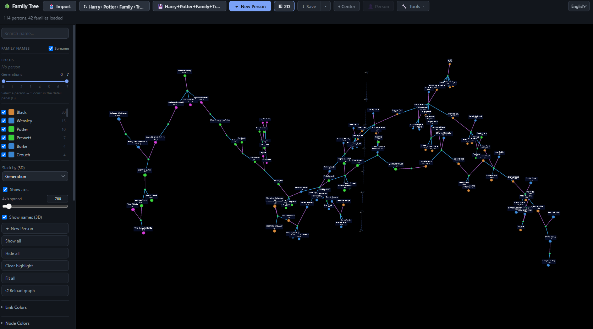
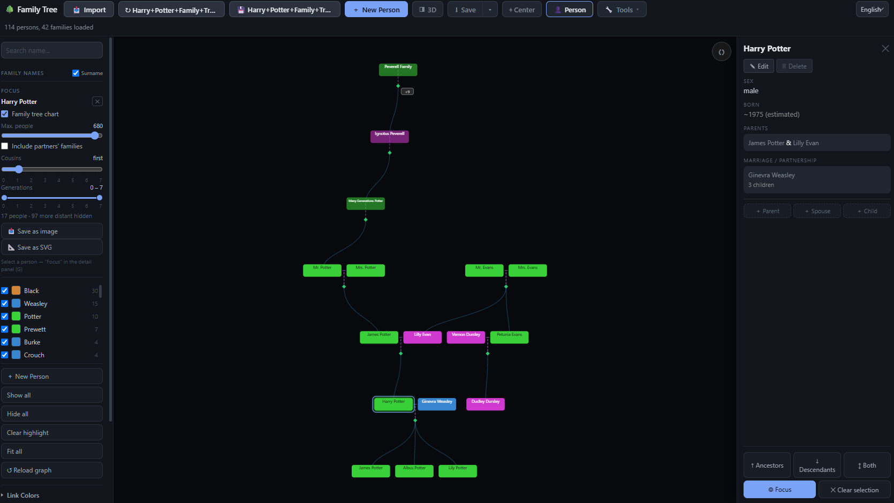
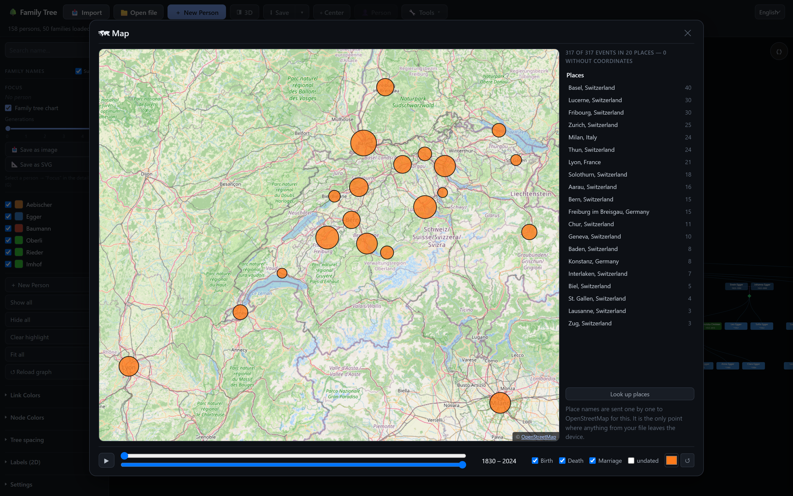
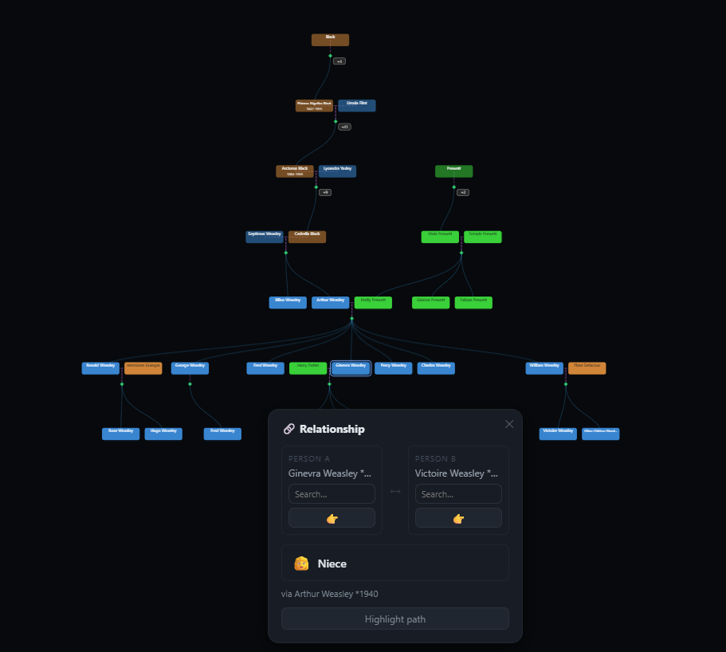
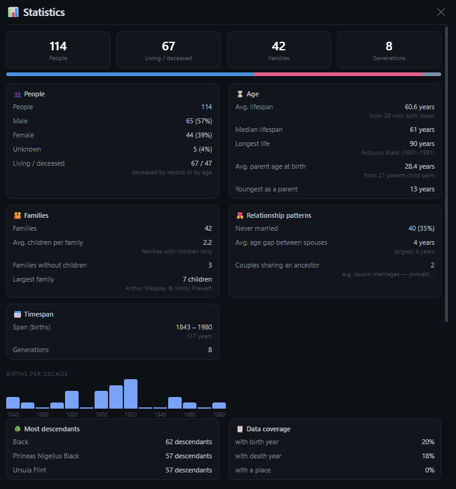

# Stemma

Browser-based family tree viewer and editor for GEDCOM files. Load a `.ged`, `.zip`/`.gdz`, JSON or YAML file, explore it as a 2D chart, force graph or orbitable 3D graph, edit people and families, attach photos and documents, save back.

Everything runs locally. Your tree is never uploaded; see [Network use](#network-use) for what does touch the network.

## Run

```bash
git clone https://github.com/lucafluri/stemma
cd stemma
python -m http.server 8000
```

Open `http://localhost:8000`. `js/` loads as native ES modules, so `file://` will not work.

## Views

### 3D graph

Whole tree as a force graph, stacked by generation. Press `V` to switch between 2D and 3D.



### 2D chart with focus

Narrow the chart to one person plus relatives out to a chosen generation and cousin distance. The detail panel edits the record and adds parents, spouses and children.



### Map

Every birth, death and marriage that names a place, sized by event count. Sweep the year range to watch the family move, filter by event type, click a place for its events. Place names are only sent to OpenStreetMap when you press **Look up places**.



### Relationship finder

Pick two people, get the relationship label and the connecting path, then highlight that path in the chart.



### Statistics

Counts, lifespans, family sizes, births per decade, most descendants and data coverage. Every figure drills down to the people behind it.



## Features

| | |
|---|---|
| Views | 2D chart, 2D force graph, 3D graph |
| Editing | click a person or family; add parents, spouses, children; dates as fields (incl. `BET … AND`, `FROM … TO`) or free text |
| Undo | every edit, deletion, import and merge; `Ctrl+Z` / `Ctrl+Shift+Z` |
| Media | photos, video, audio, PDFs and web links on people and families; portrait in the panel; see [Media](#media) |
| Changes | field-level log of every edit since load or last save, which is exactly what a save writes |
| Data check | impossible dates, implausible parent ages, circular ancestry, possible duplicates |
| Import | GEDCOM (UTF-8, UTF-16, ANSEL, ANSI), `.zip`/`.gdz` with media, JSON/YAML into an empty tree or merged with review; plain text and scanned charts (OCR via Tesseract) |
| Export | GEDCOM, GEDCOM + media (`.zip`), JSON, YAML; the 2D chart also as PNG or SVG |
| Round-trip | tags the editor has no field for (sources, notes on events, `PEDI`, `_FREL`, name suffixes, alternate names, …) are kept and written back in place |
| Working file | Chromium only: reopen the last file and save back over it |
| Auto-deceased | people born or estimated more than 110 years ago are marked deceased on save (can be switched off) |
| Autosave | unsaved edits survive a reload or crash (IndexedDB, any tree size) |

## Keyboard

| Key | Action |
|---|---|
| `V` | switch 2D / 3D |
| `F` | fit everything on screen |
| `C` | centre the view |
| `P` | centre on the selected person |
| `G` | focus the chart on the selected person |
| `E` | edit the selected record |
| `R` | clear ancestor/descendant highlighting |
| `Shift+R` | reheat the 2D simulation |
| `A` / `N` | show / hide all surnames |
| `0` `+` `-` | reset zoom, zoom in, zoom out |
| `Esc` | close the detail panel |
| `/` | jump to the search box |
| `Ctrl+Z` / `Ctrl+Shift+Z` | undo / redo |

## Layout

| Path | Purpose |
|---|---|
| `index.html` | the UI |
| `styles.css` | all styling |
| `gedcom.js` | GEDCOM/JSON/YAML parser and serializer, character-set decoding |
| `i18n.js` | German and English strings |
| `js/` | app modules (state, settings, rendering, import, media, zip, storage, undo, check, map, stats, relations) |
| `vendor/` | vendored runtime dependencies (d3, three.js) |
| `tests/` | plain Node test suites |

## Media

Attach files from the detail panel (**＋ Add**, or drop files onto it). They are stored in the browser (IndexedDB) and recorded in the tree the standard GEDCOM way, so other programs understand them:

```
0 @I1@ INDI
1 OBJE @O1@
2 _PRIM Y
0 @O1@ OBJE
1 FILE media/anna-1920.jpg
2 FORM jpg
3 TYPE photo
2 TITL Anna, 1920
```

- **Save** still writes a plain `.ged`: the records and paths, not the files.
- **GEDCOM + media (.zip)** writes the `.ged` plus every file at the path it names. Unzip it and Gramps, RootsMagic, Family Tree Maker or webtrees find the pictures; GEDZIP (`.gdz`) readers open it directly. Absolute paths from another program are rewritten to `media/…` inside the archive only.
- Opening a `.zip`/`.gdz` (ours or another program's) matches its files to the tree's `FILE` paths. For a `.ged` whose pictures sit in a folder, use **Settings → Locate media files…**.
- The first image, or the one marked `_PRIM`, is the portrait.
- The whole feature can be switched off in **Settings**; media already in a file is then kept but not shown.

## Large files

Tested with generated trees of 100,000 people (22 MB GEDCOM): parsing ~1.3 s, statistics ~2 s, data check ~1.2 s. Above 1,500 people the chart opens on the best-connected person's relatives; search, find, statistics and the map reach everyone, and picking someone outside the drawn set re-centres the chart on them. The 2D chart only puts on-screen boxes into the DOM and draws an overview canvas when zoomed out; the export still contains the whole chart.

## Tests

```bash
npm install   # only jsdom is needed
npm test
```

## Browser support

- Chromium, Firefox and Safari run the app.
- Working file (reopen and save in place) needs the File System Access API, so Chromium only. Elsewhere the buttons hide and saving falls back to a download.
- 3D on mobile reduces resolution and disables name labels by default.

## Network use

Nothing from your file is sent anywhere unless you ask. What does touch the network:

| What | When | What is sent |
|---|---|---|
| Umami analytics (`index.html`) | page load | an anonymous page view; nothing from your file |
| OpenStreetMap tiles | opening the map | the map viewport, nothing from your file |
| Nominatim geocoding | pressing "Look up places" and confirming | one place name per request, at most one per second |
| Tesseract.js | importing an image for OCR | nothing; the library is fetched, the image is read locally |
| Web-link media | viewing a medium attached as a URL | the browser loads that URL |

Looked-up coordinates are cached in `localStorage` under `placeCoords`, so each spelling is asked once. Without a connection the map still draws its circles over an empty background.

That cache is per browser. To put coordinates into the tree itself, tick places in the map list and press **Write coordinates**. This writes `map: [lat, lon]` onto each matching birth, death and marriage, exported as the standard GEDCOM subtree:

```
2 PLAC Bern
3 MAP
4 LATI N46.947975
4 LONG E7.447447
```

Nothing is written without that tick. A geocoder asked for "Freiburg" picks one of two countries and does not mention it had a choice. When it picks wrong, open the place in the map list: it shows where the place currently sits, takes a better query ("Fribourg, Switzerland"), lists candidates, and can remove the coordinates again.

Coordinates already present in a loaded file are used as-is, with no lookup. Changing a place name anywhere (detail panel, import, place-name tool) drops that field's coordinates, since they were found for the old spelling.

## Settings

Every setting (surname colours, node and link colours, label style, tree spacing, physics, 3D appearance and scene budgets, last view) is declared in one table in `js/settings.js` and stored in `localStorage` under its own key. Nothing else reads or writes those keys.

The **Settings** panel at the bottom of the sidebar is the whole surface:

- **Save settings** writes them all to a JSON file.
- **Load settings** reads one back. Unknown keys are ignored, so a file from a newer version cannot wedge an older one.
- **Reset everything** restores defaults. It clears only registry-owned keys; the autosaved tree, stored media and the geocoded place cache (`placeCoords`) are data, not settings, and are kept.
- **Media** switches attachments on or off; **Locate media files…**, **Media status** and **Remove unused media** manage the files stored in this browser.
- **Mark the very old as deceased** switches the auto-deceased rule off.
- **Render timings in the console** replaces `localStorage.perfLog = '1'`. Takes effect on next load.

A stored value that is missing, unparseable or out of range falls back to its default rather than reaching the renderer. Object settings fall back key by key, so one bad number does not discard a tuned scene.

## Deployment

GitHub Pages serves the repository as-is from `master` (see `.github/workflows/static.yml`).
